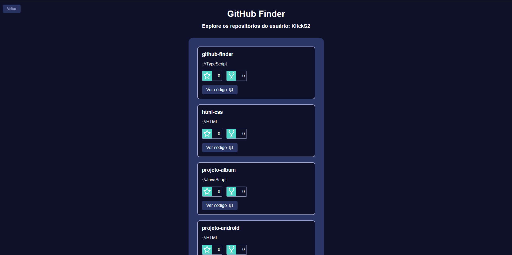

# Projeto GitHub Finder

## Descrição

O projeto GitHub Finder é uma aplicação desenvolvida para encontrar perfis de usuários no GitHub. Ao inserir o nome de usuário desejado na área de busca, a aplicação exibe informações sobre esse usuário, incluindo sua foto de perfil, nome de usuário, número de seguidores, número de pessoas seguidas e localização (se disponível). Se o usuário não for encontrado, a mensagem "Usuário não encontrado" é exibida. Além disso, há um botão "Ver repositórios" que leva o usuário para uma página de repositórios, onde cada repositório é listado individualmente, exibindo seu nome, linguagem utilizada, número de estrelas e número de forks. Cada área de repositório também contém um botão que redireciona o usuário para o repositório correspondente no GitHub, abrindo uma nova página.

## Funcionalidades

### Página Home

* Campo de busca de usuários do GitHub.
* Exibição do perfil do usuário encontrado.
* Mensagem de "Usuário não encontrado" se o usuário buscado não existir.
### Página de Repositórios

* Listagem de repositórios do usuário encontrado.
* Informações detalhadas de cada repositório, incluindo nome, linguagem, número de estrelas e número de forks.
* Botão para redirecionar o usuário para o repositório no GitHub.
* Botão para voltar para a página busca.

## Tecnologias Utilizadas

* TypeScript
* JavaScript
* HTML
* CSS
* ReactJS (para componentização e manipulação do estado)
* Front-end (foco na interface do usuário)

## Imagens

### Página de Busca

### Usuário Encontrado

### Página de Repositórios

